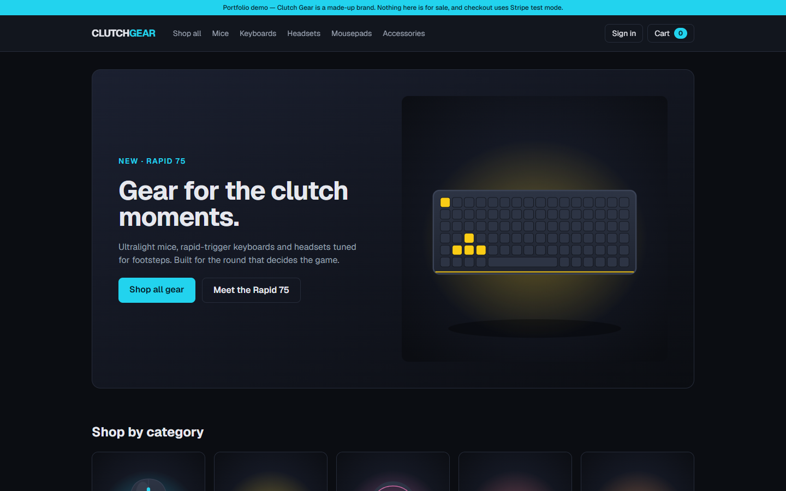
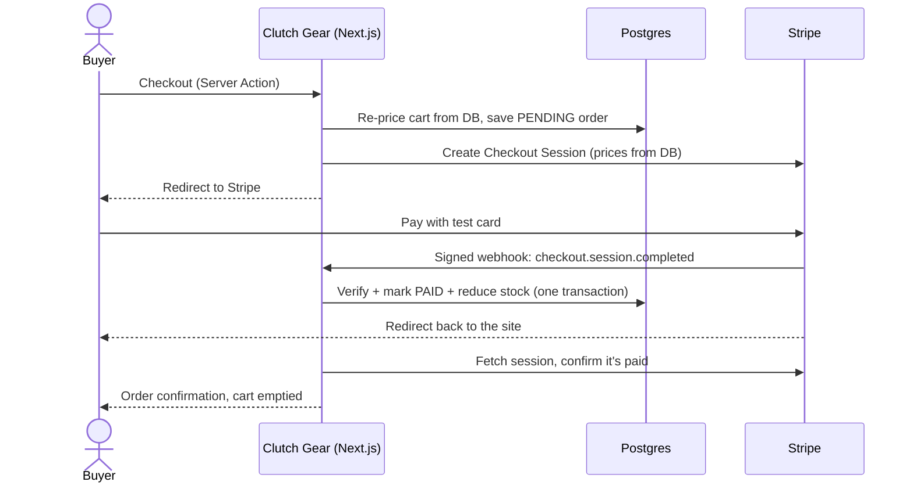
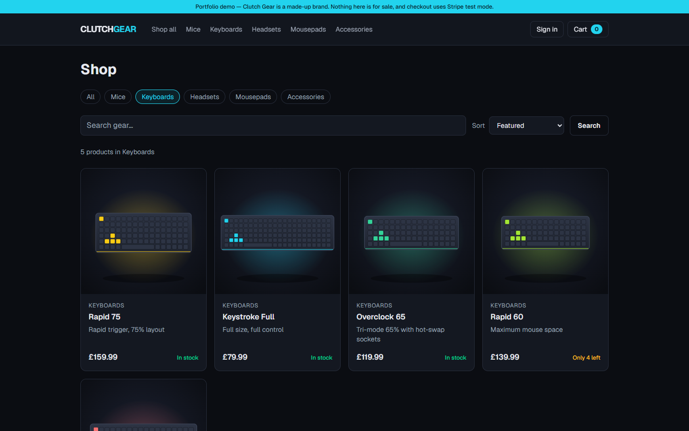
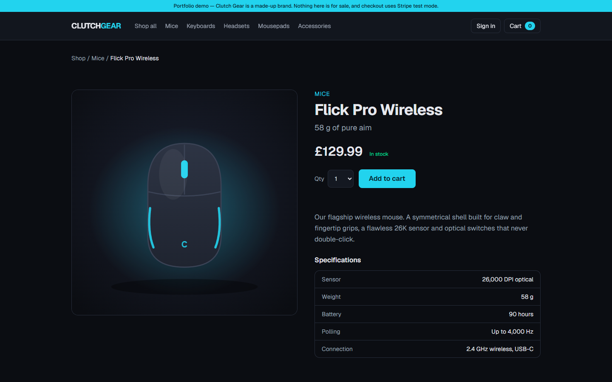
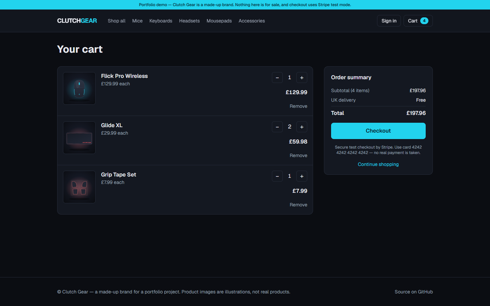
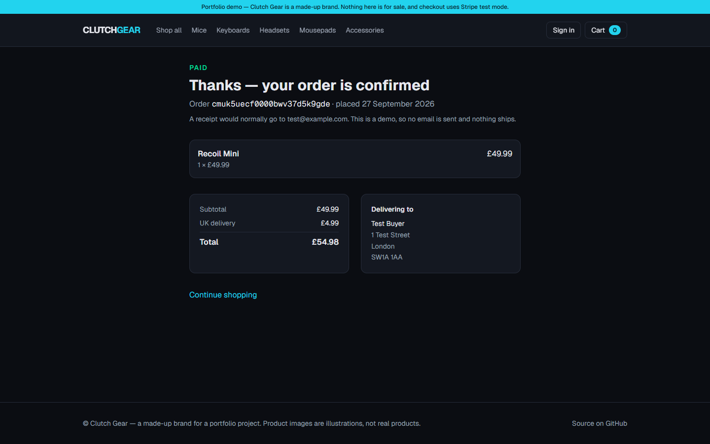
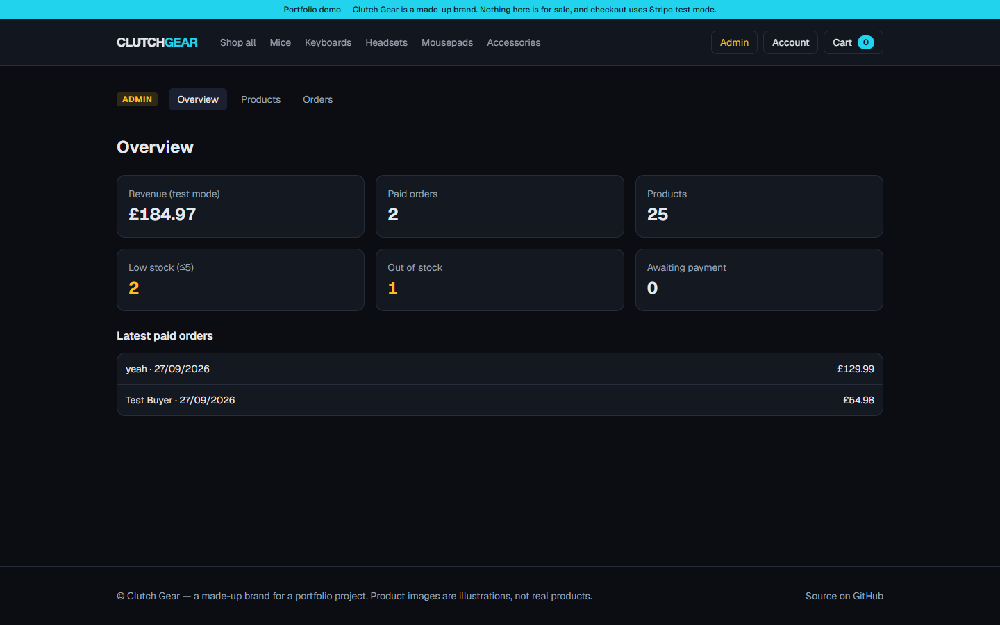
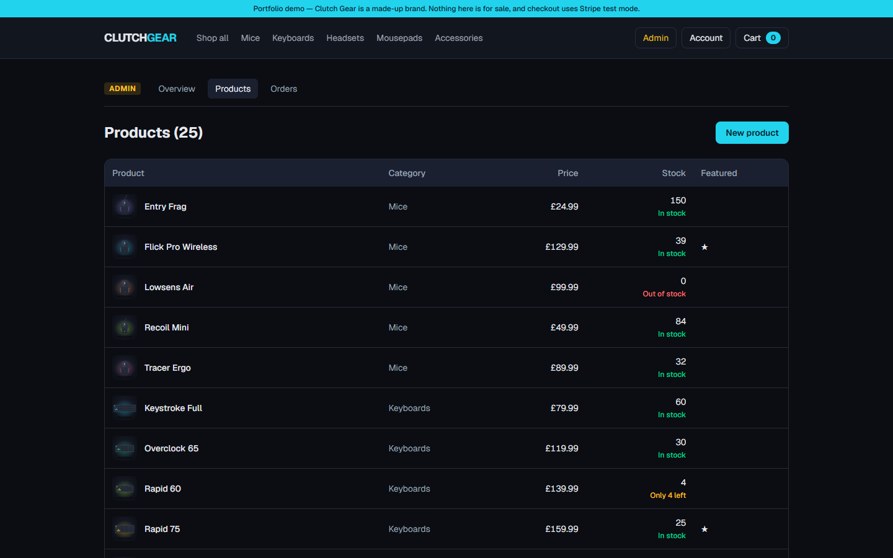
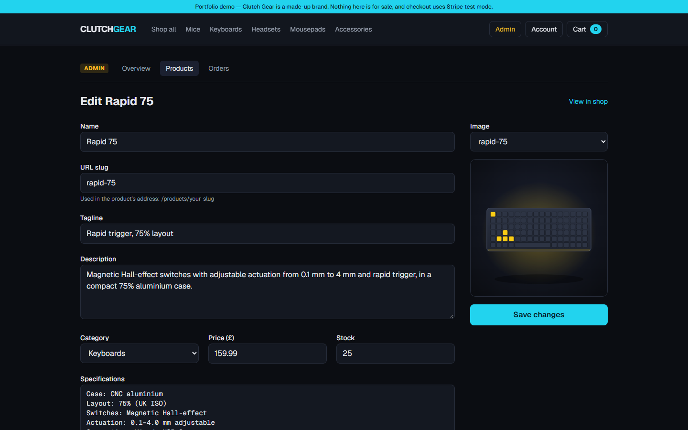
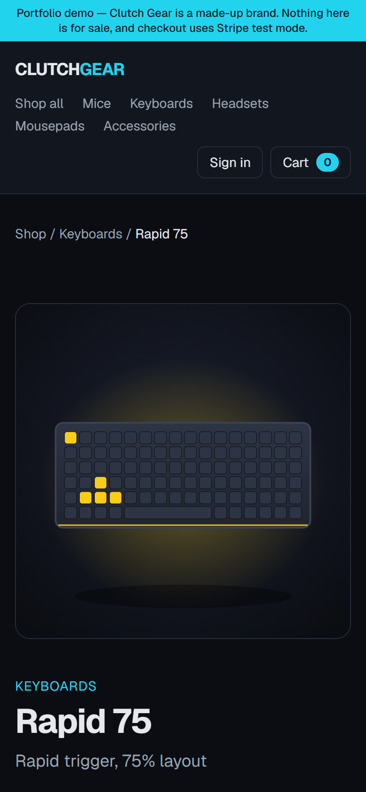

# Clutch Gear

[](https://github.com/fraze7/clutch-gear/actions/workflows/ci.yml)

A full-stack e-commerce store for a made-up gaming gear brand: product catalogue, cart, Stripe checkout,
GitHub sign-in with order history, and an admin area. Built with Next.js 16, TypeScript, PostgreSQL and Stripe.

**Live demo: [clutch-gear.vercel.app](https://clutch-gear.vercel.app)**

> **Portfolio demo.** Clutch Gear isn't a real brand and nothing is for sale. Checkout runs in Stripe **test mode**:
> pay with card `4242 4242 4242 4242`, any future expiry and any CVC. No real money moves.



## Features

**Shopping**
- Catalogue of 25 products with category filters, search and sorting — the URL holds the filters, so any view can be shared
- Product pages with specs, live stock ("Only 3 left", "Out of stock") and related products
- Cart with quantity controls, stock limits and UK delivery (£4.99, free over £50)
- Checkout on Stripe's hosted payment page, then an order confirmation page

**Accounts**
- Sign in with GitHub; guest checkout still works
- Account page with order history; orders placed while signed in are private to that account

**Admin** (for users with the admin role)
- Overview of revenue, orders and stock alerts
- Create, edit and delete products, with validation
- All orders with status filters

## How it works

The part worth reading is checkout, because it's where money and stock change hands:



### Design decisions

- **The browser is never trusted with prices.** The cart cookie holds only product slugs and quantities; every price
  shown or charged is read from the database on the server.
- **Only Stripe can mark an order paid.** The webhook verifies Stripe's signature, then checks the session ID, amount and
  currency match the order before marking it paid. The return page double-checks with Stripe directly, so the order is
  confirmed even if the webhook is a moment late.
- **Fulfilment is idempotent.** Stripe can deliver the same webhook more than once, and the return page may run too — an
  order is only ever marked paid once, and stock is reduced in the same database transaction (never below zero).
- **Orders keep a copy of what was bought.** Each order line stores the product's name and price at the time, so editing
  or deleting a product never changes a past order.
- **Every Server Action checks permissions itself.** Server Actions are public endpoints, so the admin actions check the
  user's role inside each action — not just on the page. Non-admins get a normal 404 for `/admin`.
- **Roles can't be set through the site.** The `role` field is server-only; admins are made from a terminal
  (`npm run set-role`).
- **It can't take real money.** The Stripe client refuses to start with a live key.
- **Caching with invalidation.** Product data is cached with Next.js Cache Components (`'use cache'` + tags); admin edits and
  stock changes refresh it immediately.
- **Works without JavaScript.** Search, sorting, add-to-cart, the cart buttons and sign-in are plain forms and Server Actions.
- **Made-up brand and art.** Product images are SVG illustrations generated by a script, so there are no real brands or
  photos involved.

## Screenshots

| | |
|---|---|
|  |  |
| **Shop** — filters, search and sort | **Product page** — specs, stock and add to cart |
|  |  |
| **Cart** — live prices, free delivery over £50 | **Order confirmation** — after a Stripe test payment |
|  |  |
| **Admin overview** | **Admin products** |
|  |  |
| **Admin product editor** | **Mobile** |

## Tech stack

| | |
|---|---|
| Framework | [Next.js 16](https://nextjs.org) (App Router, Server Actions, Cache Components), React 19, TypeScript |
| Styling | Tailwind CSS 4 |
| Database | PostgreSQL on [Neon](https://neon.tech), [Prisma 7](https://www.prisma.io) |
| Payments | [Stripe Checkout](https://stripe.com/docs/payments/checkout) + webhooks (test mode) |
| Auth | [Better Auth](https://www.better-auth.com) with GitHub sign-in |
| Testing | [Vitest](https://vitest.dev), React Testing Library |
| CI / hosting | GitHub Actions, Vercel |

## Testing

```bash
npm test
```

96 tests across 14 files, run by GitHub Actions on every push and pull request (with lint and type checks). They focus on
the parts where mistakes cost money or leak data:

- **Checkout and orders** — Stripe webhook signature checks (forged and tampered events are rejected), paying twice,
  wrong amounts, two buyers taking the last item
- **Cart** — the cookie is treated as untrusted input: malformed data, fake products, huge quantities and injected prices
- **Security rules** — anonymous visitors and customers calling admin actions directly, users trying to set their own role,
  open redirects after sign-in, private orders
- **Business logic** — filters, sorting, price formatting, stock rules, delivery charges, product form validation

## Running locally

You'll need Node 24, a [Neon](https://neon.tech) (or any Postgres) database, a Stripe account in test mode and a
[GitHub OAuth app](https://github.com/settings/developers) with the callback URL
`http://localhost:3000/api/auth/callback/github`.

```bash
npm install
```

Create `.env.local`:

```
DATABASE_URL="postgresql://..."          # direct connection, used for migrations
DATABASE_URL_POOLED="postgresql://..."   # pooled connection, used by the app
STRIPE_SECRET_KEY="sk_test_..."          # test mode only — live keys are refused
STRIPE_WEBHOOK_SECRET="whsec_..."        # optional locally; required in production
BETTER_AUTH_SECRET="..."                 # any long random string
BETTER_AUTH_URL="http://localhost:3000"
GITHUB_CLIENT_ID="..."
GITHUB_CLIENT_SECRET="..."
```

Create the tables, add the products and start the dev server:

```bash
npm run db:migrate
npm run db:seed
npm run dev
```

Locally, orders are confirmed by the checkout return page, so the webhook secret is optional. To test the webhook itself,
use the [Stripe CLI](https://docs.stripe.com/stripe-cli): `stripe listen --forward-to localhost:3000/api/stripe/webhook`.

### Becoming an admin

Sign in once, then from a terminal:

```bash
npm run set-role -- you@example.com admin
```

An **Admin** link appears in the header.

### Scripts

| Script | What it does |
|---|---|
| `npm run dev` | Dev server on http://localhost:3000 |
| `npm test` | Tests (`npm run test:watch` to re-run on save) |
| `npm run lint` / `npm run typecheck` | ESLint / TypeScript |
| `npm run db:migrate` | Apply database migrations |
| `npm run db:seed` | Add or update the 25 demo products (safe to re-run) |
| `npm run db:studio` | Browse the database |
| `npm run art` | Regenerate the SVG product illustrations |
| `npm run set-role -- <email> <customer\|admin>` | Change a user's role |

## Project structure

```
prisma/
  schema.prisma          # products, orders, users (Better Auth tables)
  products-data.ts       # the 25 demo products
src/
  app/
    products/            # catalogue and product pages
    cart/                # cart page + cart and checkout Server Actions
    checkout/complete/   # Stripe return route
    api/stripe/webhook/  # Stripe webhook
    api/auth/            # Better Auth endpoints
    account/ sign-in/    # accounts
    orders/[id]/         # order confirmation / details
    admin/               # admin pages and Server Actions
  lib/                   # business logic: cart, checkout, orders, auth, admin checks, validation
  components/            # UI components
scripts/                 # product art generator, set-role
```

## What I'd add next

- A separate production database branch, so local testing never touches live data
- Order confirmation emails
- Product image uploads in the admin area
- Reviews and ratings
- End-to-end browser tests (e.g. Playwright) for the full checkout flow

See [PLAN.md](PLAN.md) for the build order and more detailed notes.
